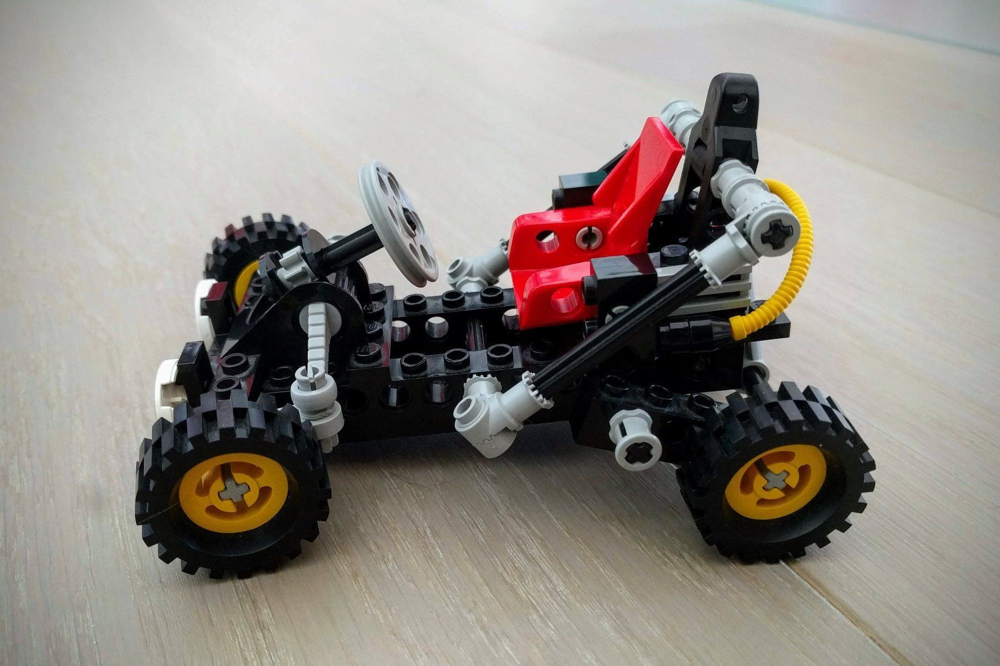

# Legoset classification

I built a convolutional neural network on the basis of ResNet50 with the goal of classifying images of used lego sets from three different product lines: Duplo, Star Wars and Technic. I am using the data generated with my Ricardo webscraping code (see my other repository). The network currently achieves a classification accuracy of 82%. It is work in progress.

**Note**: This repository was inspired by an in-class exercise during my Data Science Bootcamp at [Propulsion Academy](https://propulsion.academy/).

          
